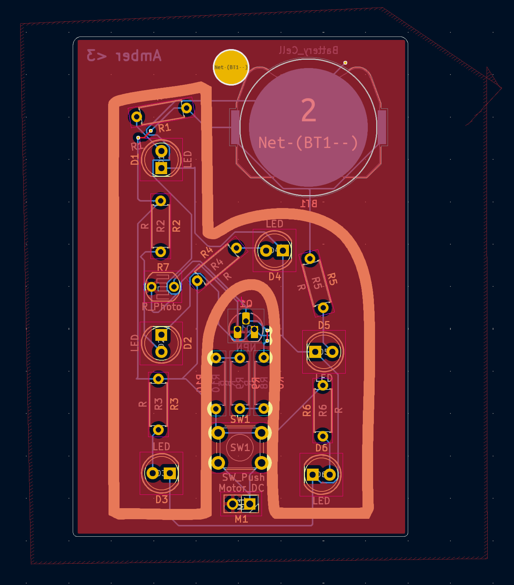

# Hack Club LED Fidget Keychain

For my [Solder](https://solder.hackclub.com) project, I decided to make a keychain that has LEDs arranged into the Hack Club "h" logo. The LEDs turn on when it gets dark, and turn off when it's light, using a photoresistor. The design also features a button controller vibration motor for maximum fidgeting ability.

## Parts List
- 1x PCB
- 6x LEDs
- 6x 220Ω resistors
- 3x 4.7kΩ resistors
- 1x Photoresistor
- 1x Push button
- 1x Vibration motor
- 1x CR2032 battery holder
- 1x CR2032 battery
- 1x NPN transistor

## Images

### Schematic

### PCB

### 3D Model

_Made by Amber - @transcental on Slack_